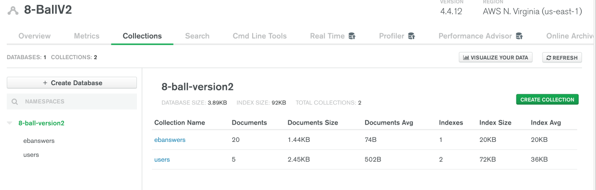

<h1 align="center">React Specialization Capstone: 8-Ball Fortune Teller V2</h1>

## Table of contents

- [Overview](#overview)

  - [V1 Links](#v1-links)

  - [V2Project Goal](#project-goal)
  - [Reasons for choosing this project](#reasons-for-choosing-this-project)
  - [MVP](#build-features)
  - [Version 2 New Editions](#v2-new-editions)
  - [Technologies Used](#technologies-used)
  - [What I Am Proud Of](#what-i-am-proud-of)
  - [Continued development](#continued-development)
  - [Data Model](#data-model)

- [Author](#author)

## Overview

### V1 Links:

- Solution URL: [Github](https://github.com/MSPayneII/foundations-capstone)
- Live Site URL: [Heroku](https://mpayne-foundation-capstone.herokuapp.com/)

### Project Goal:

Improve upon version 1 of the 8-Ball Fortune Teller application (my Foundation Capstone built with vanilla JavaScript) and showcase the knowledge gained in my React Specialization.

### Reasons for choosing this project:

- Take an existing application built with vanillaJS and rebuild it using React
- Praticing building a CRUD application in React
- Connect the application to a relational Database

### MVP:

- Users can login/create an account
- Users can ask the eightball questions
- Users receive a randomly generated answer on the eightball
- Question and answers pairs are displayed in a user's record (maybe a dashboard format)
- Users can clear records collectively or individually depending on their preference
- Users can update their profile with an avatar photo
- Users can receive horoscope information for various signs in daily, weekly, monthly format. This feature will use a horoscope API
- Users can delete their account

### Technologies Used:

- React
  - React router dom
  - functional components
  - react hooks: useState, useEffect, useContext, maybe useReducer
- Axios
- Node/Express
- Material UI (might build the CSS myself)
- PostgresSQL

### V2 New Editions

- Responsive design (mobile, tablet, desktop)
- Horoscope Information via API data
- Separate Pages
  - Landing
  - User login/register (user authentication included)
  - User question/ eightball display
  - Horoscope display page that pulls in horoscope API data based on the user's birth sign or user input
  - User profile with dashboard
- Better page navigation
- Sidebar with links and displays various pages
  - Purpose: reduce unnecessary scrolling
- Database Connection
  - PostgresSQL
- Backend
  - Node/express
- React Hooks
  - useState, useEffect, useContext, maybe useReducer
- React propTypes

### Data Model

### Author

👤 **Michael Payne**

- Website: [Michael Payne] (https://michaelspayneii.com/)
- Github: [@MSPayneII](https://github.com/MSPayneII)
- LinkedIn: [@michaelspayneii](https://linkedin.com/in/michaelspayneii)
